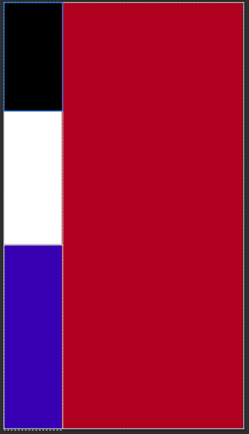

# 리니어 레이아웃(Linear Layout)
- 부모가 될 수 있는 뷰 (컨테이너 뷰)
- 자식의 위치를 설정하는 뷰
	- 가로, 세로로 설정 할 수 있다.
	
- 속성
	- orientation : 자식의 뷰의 방향을 설정
	- weight : 자식이 차지하는 크기의 비율을 설정
	- layout_weight: 레이아웃 차지하는 비율
	
크기를 설정하는 특수한 키워드
- match_parent
	- 부모 뷰의 크기만큼 설정 하겠다.
- wrap_content
	- 내용물의 크기만큼 설정 하겠다.(가로, 세로)

### 결과 화면
 - android:orientation="vertical" // 수직정렬
 - android:layout_weight=["2", "3", "5"] // 비율 2 : 3 : 5

