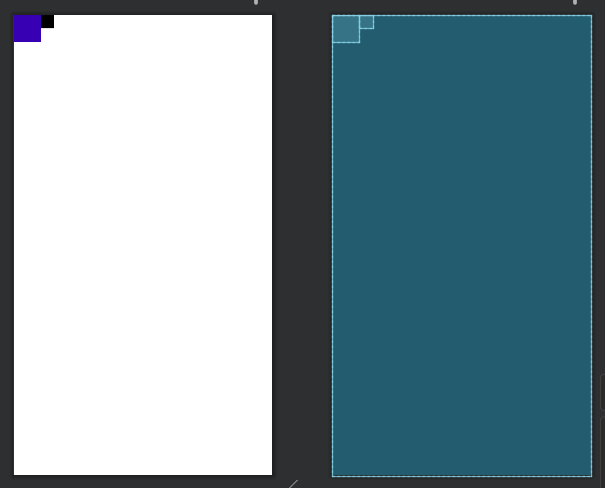
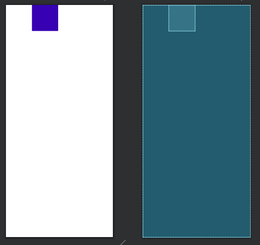
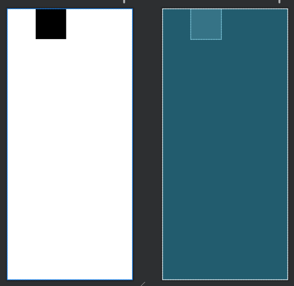
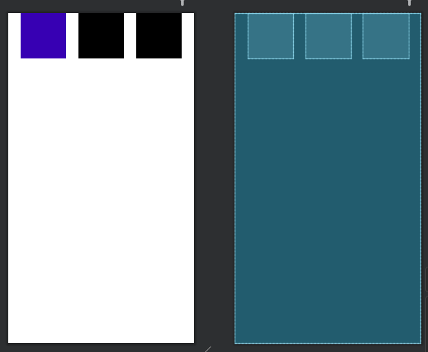
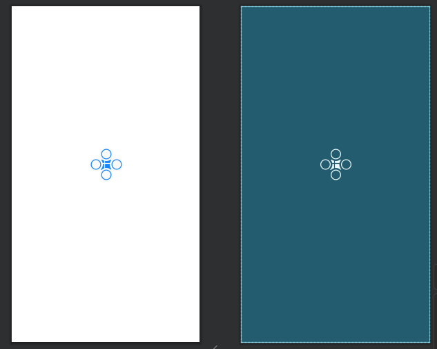
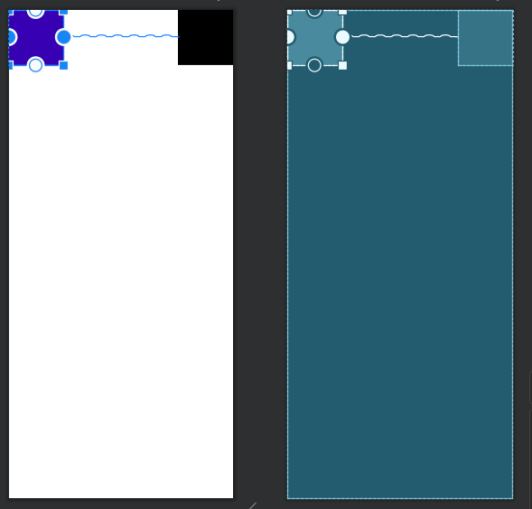

# ConstraintLayout
- 제약을 통해서 뷰를 배치하는 컨테이너뷰
- RelativeLayout에서 할 수 있는 모든것이 가능하다.
- 기능이 엄청나게 많다.
- 반대 방향으로 작용하는 두 개의 제약을 동시에 적용하면 두 제약의 가운데에 배치된다.

1. 상대적 위치 배치(RelativeLayout기능)
	- layout_constraint + 제약이름
	- layout_constraintLeft_toLeftOf
		- B Left_toLeftOf A : B의 왼쪽은 A의 왼쪽에만 올수 있도로 하겠다.
			- Left -> 속성이 적용되는 뷰의 Left
			- toLeftOf -> Of에 올 뷰의 Left
		- A가 될수 있는 것들
			- 아이디로 설정된 뷰 들
			- parent
				- B Left_toLeftOf parent

  
  
2. 여백
- 해당 방향으로 여백을 두기 위해서는 반드시 그 쪽 방향에 제약이 있어야 한다
- layout_marginLeft = "100dp"
- layout_constraintLeft_toLeftOf = "parent"

  

3. Bias(치우침)
- layout_constraintHorizontal_bais = 값
- layout_constraintVertical_bias = 값
- 값
	- 비율로 설정을 해준다.
	- 1인 경우 100%치우친다.
	- 0.5 인경우 0% 치우친다. → 변화가 없다.
  
  

4. 비율로 설정하는 방법 -> LinearLayout Weight
- layout_constraintHorizontal_Weight
- layout_constraintVertical_Weight
- 비율을 주려는 세로 또는
  
  

5. 원형 위치 설정(Circular Positioning)
- layout_constraintCircle: 기준을 정한다.
- layout_constraintCircleRadius : 두 중심 간의 거리
- layout_constraintCircleAngle : 각도
  
  

6. Chain 속성
- Spread Chain
- Spread Inside
- Packed
  
  

### 언어의 특징
- LTR(Left to Right) : 글자를 적는 방향이 왼쪽에서 오른쪽 → Start = Left, End = Right
- RTL(Right to Left) : 글자를 적는 방향이 오른쪽에서 왼쪽 → Start = Right End = Left
Right	End
Left 	Start
