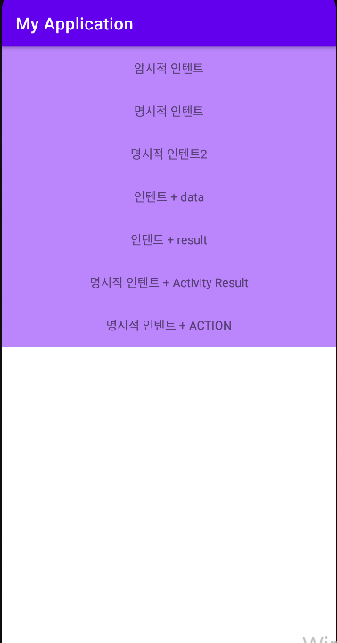

# 04.Intent

### Intent
- 의도, 의사
- A야 B좀 해줘
- A좀 해줘
- A야 B좀 해줘 그리고 다하면 알려줘
- 데이터를 같이 전달할 수 있다.

- 명시적 인텐트(Explicit Intent)
	- 호출될 대상을 명시하는 경우
- 암시적 인텐트(Implicit Intent)
	- 호출될 대상을 명시하지 않을 경우
	- 인텐트 필터(Intent - filter)
		- 암시적 인텐트를 보낸 경우, 인텐트가 처리할 수 있는지 확인할 때 사용
- 인텐트 호출 대상
	- 앱네에서
		- 엑티비티 끼리
	- 외부(안드로이 OS, 시스템), 앱 끼리(권한이 필요하다.)
	- 사진 앱
		- 우리 앱 → 시스템 → 사진첩
		- 우리 앱 전화 걸기 버튼 → 시스템 → 전화 걸기 앱
		
- 인텐트
	- 결과가 필요한 경우
	- 결과가 필요하지 않을 경우
- 사용하는 경우
	- 인텐트를 이용해서 키벨류 데이터를 전달한다
	- 인텐트를 이용해서 이미지를 전달한다
	
### Context(문맥 - 앱의 흐름)
#### Application Context
- 하나만 존재

#### Activity Context
- Activity마다 존재
- Context를 구현하고 기능을 추가한게 → Activity

```
책(Application Context)
	Chapter1 (Activity Context)
		chapter1-1
		chapter1-2
	Chapter2 (Activity Context)
		chapter2-1
	Chapter3 (Activity Context)
		chapter3-1
		chapter3-2
		chapter3-3
```

### 결과

