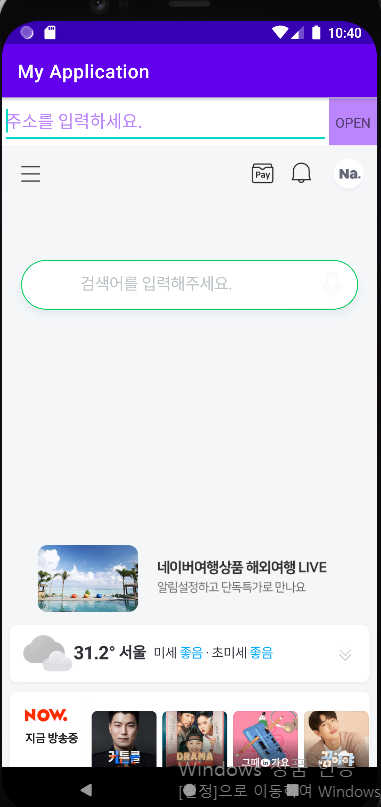

# 03.과제

### 과제 내용
- Webview를 이용해서 웹페이지 로드하기

- 기능
1. URL주소를 입력할 수 있다.
2. 버튼을 통해서 입력된 URL 주소를 webview에서 로드할 수 있다.

- 난이도
1. 기본 - intent를 사용하지 않고 webview에 url을 로드한다.
2. 어려움 - intent를 사용해서 webview에 url을 로드한다.
### 결과화면

