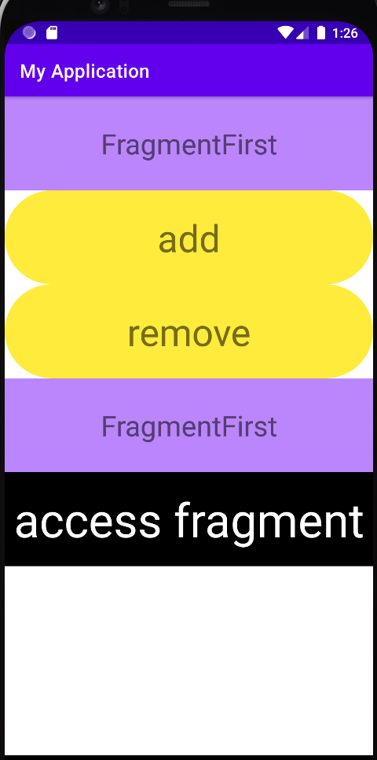

# 07																														.Fragment

### Fragment
1. 정의
- 모듈식(재사용)
- Fragment는 FragmentActivity 내의 어떤 동작 또는 사용자 인터페이스의 일부를 나타낸다. 여러 개의 fragment를 하나의 액티비티에 결합하여 창이 여러 개인 UI를 빌드 할 수 있으며, 하나의 fragment를 여러 액티비티에서 재사용 할 수 있다.
- fragment는 액티비티의 모듈식 섹션이라고 생각하면된다.
- fragment는 자체적인 수명 주기를 갖고, 자체 입력 이벤트를 수신한다.
	- 수명 주기는 호스트 액티비티의 수명 주기에 직접적으로 영향을 받는다.                   
- 다른 액티비티에 재사용할 수 있는 "하위 액티비티" 같은 개념

2. 생명주기
- onAttach
	- fragment가 액티비티와 연결되어 있는 경우 호출 된다.
	- 여기에서 Activity가 전달 된다.
- onCreate
	- 프래그먼트를 생성할 때 시스템에서 호출 한다.
	- 초기화 작업을 해줘야 한다.
- onCreateView
	- 프래그먼트가 자신의 인터페이스를 처음으로 그릴 시간이 되면 호출 된다.
	- View를 반환해야 된다.
	- UI를 제공하지 않는 경우에는 null을 반환
- onPause
	- 사용자가 fragment를 떠난다는 것을 나타내는 첫 번째 신호
	- 변경 사항을 저장할때 좋다.
- onDetach
	- fragment가 액티미티와 연결이 끊어지는 중일 때 호출 된다.
3. 생성방법
- xml
```kotlin
val fragmentFirst = supportFragmentManager.findFragmentById(R.id.fragment_first) as FragmentFirst
fragmentFirst.printTestLog()
```
- 코드
```kotlin
supportFragmentManager.findFragmentByTag("fragment_first_tag") as FragmentFirst
fragmentFirst.printTestLog()
```
4. Activity와 통신 하는 방법
- 데이터 전달하는 방법
```kotlin
(findViewById<TextView>(R.id.add)).setOnClickListener{
	val transaction = fragmentManager.beginTransaction()
	// fragment에 데이터를 전달 하는 방법
	val bundle = Bundle()
	bundle.putString("key", "hello")
	fragmentFirst.arguments = bundle


	transaction.replace(R.id.root, fragmentFirst, "fragment_first_tag")
	transaction.commit() // 끝
}
```
### Tramsaction
 - 작업의 단위 -> 시작과 끝이 있다.

### Commit
 1. commit
 2. commitAllowingStateLoss
 3. commitNow
 4. commitNowAllowingStateLoss
 - commit - commitAllowingStateLoss
 	- 상태 손실을 허락한다.
 	- onStop, lifecycle 또는 os에 의해서 앱이 상태를 저장해야 할 수 있다.
 - 상태조정 : onSaveInstanceState
 - commit : 저장을 한 경우 실행 할 수 없다 (IllegalStateException)
 - commitAllowingStateLoss : 저장을 한 경우 예외가 발생하지않고 그냥 손실된 상태에서 저장된다.
 - commit - commitNow
 -	 commit → 작업을 예약한다(매인 쓰레드에 예약이 된다.)
 	- commitNow → 바로 실행


### 결과

