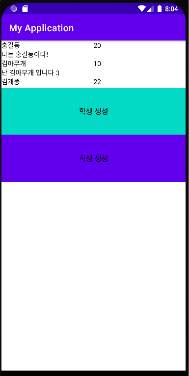
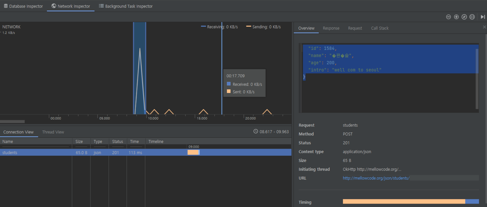

# Network
  
### Network
- 두대 이상의 컴퓨터를 연결하는 것
- 클라이언트와 서버의 연결
  - 클라이언트: 사용자가 볼 수 있는 기기(N개)
  - 서버: 사용자가 볼 수 없는 기기(1개)
- 네트워크가 필요한 이유
  - 클라이언트(앱) → (internet) → 서버: 요청(첫화면을 그리려고 할때 데이터를 서버한테 가저요기)
  - 서버 → (internet) → 클라이언트(앱): 화면을 그릴 수 있는 데이터가 도착(응답)
  - 클라이언트 Request(요청) 서버가 response(응답)를 보낸다.
- 대부분의 앱들이 정보를 서버로부터 받아서 화면을 구성한다. 문제점은 없을까?
  - 매번 똑같은 화면을 그리는데 매번 요청을 하면 → 낭비 → 해결책 : 캐싱 → 캐싱은 구현 난이도 높다.
    - 한번 받은 데이터를 클라이언트가 로컬 데이터베이스에 저장을 하고 다시 필요한 경우에 서버에게 요청을 하는 것이 아리나 로컬 데이터베이스에 있는 데이터를 이용한다.
- 네트워킹
  -  서버와 클라언트의 의사소통
  -  네트워크 약속(프로토콜) 존재한다.

### 네트워크 프로토콜(규약)
- FTP → 파일 전송 규약
- SMTP → 메일 전송 규약
- HTTP → 인터넷 서비스를 위한 규약

### Request(클라이언트가 서버에게 보내는 요청)
- Request Header
  - 요청에 대한 추가 정보
- Request Body
  - 추가 정보
  - JSON 형태로 보낸다
- Request Method

### Response(서버가 클라이언트에게 보내는 응답)
- Response Code
  - 응답의 요약

### JSON
- {}: 객체
- []: 배열
- key-value
- 문자열
- 숫자(정수, 소수)

### Serializing(Serializer)
- 꼬챙이로 객체를 담는다.
- 학생 객체 (이름, 번호, 나이)
- 객체를 정송을 위한 데이터 포맷으로 바꿔준다.
  - 클라이언트 ------> 시리얼라이징 -------> 서버

### HttpURLConnection
- 안드로이드에서 기본으로 제공해주는 네트워크 모듈
- 매우 번거롭다.

### HttpURLConnection의 사용을 편하게 만들어준 라이브러리
- Vally
- Retrofit
- OKHttp
- 기타등등

### 실행 결과
#### 화면

#### 로그
